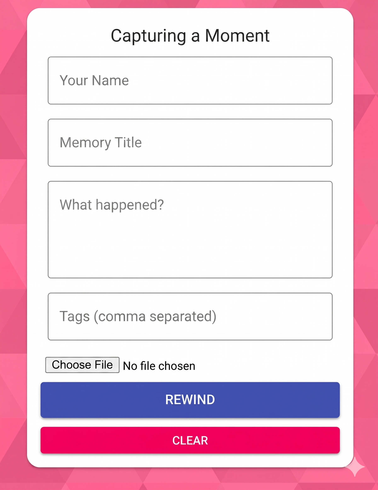
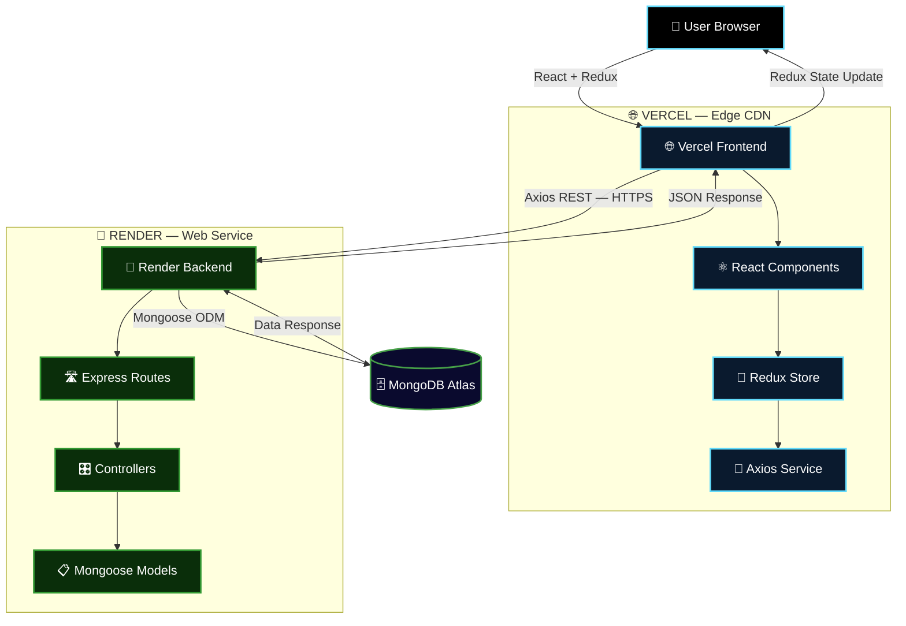
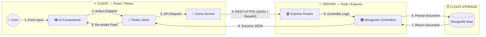
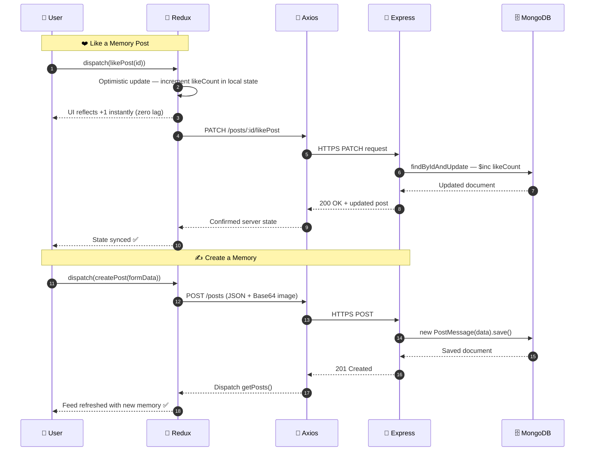
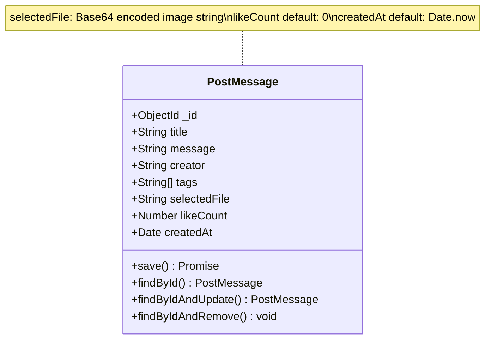

<div align="center">


<br/>

<!-- ── Hero Image ── -->
<a href="https://rewind-pied.vercel.app">
  
</a>

<br/><br/>


<br/><br/>


<br/>


<br/>


<br/><br/>

> *"A feature-rich social memory platform built on the MERN stack — where every scroll is a trip down memory lane."*

<br/>

<a href="https://rewind-pied.vercel.app"></a>
&nbsp;
<a href="https://rewind-api-alwp.onrender.com"></a>
&nbsp;
<a href="#9--getting-started"></a>
&nbsp;
<a href="#12--contributing"></a>

</div>

---

## 📋 Table of Contents

1. [📸 What is Rewind?](#1--what-is-rewind)
2. [🖼️ UI Showcase](#2-%EF%B8%8F-ui-showcase)
3. [📊 Project at a Glance](#3--project-at-a-glance)
4. [✨ Key Features](#4--key-features)
5. [🏗️ System Architecture](#5-%EF%B8%8F-system-architecture)
   - 5.1 [📐 Architecture Diagram](#51--architecture-diagram)
   - 5.2 [🔄 Data Flow Diagram](#52--data-flow-diagram)
   - 5.3 [⚡ Request Lifecycle Sequence](#53--request-lifecycle-sequence)
6. [🗄️ Data Model](#6-%EF%B8%8F-data-model)
   - 6.1 [📋 Schema Specification](#61--schema-specification)
   - 6.2 [🧩 Entity Diagram](#62--entity-diagram)
   - 6.3 [🛠️ Implementation Snippet](#63-%EF%B8%8F-implementation-snippet)
7. [🛠️ Tech Stack](#7-%EF%B8%8F-tech-stack)
8. [📂 Project Structure](#8--project-structure)
9. [📦 Getting Started](#9--getting-started)
   - 9.1 [🔧 Prerequisites](#91--prerequisites)
   - 9.2 [⬇️ Clone & Install](#92-%EF%B8%8F-clone--install)
   - 9.3 [🔑 Environment Setup](#93--environment-setup)
   - 9.4 [🖥️ Run Locally](#94-%EF%B8%8F-run-locally)
10. [☁️ Cloud Deployment](#10-%EF%B8%8F-cloud-deployment)
    - 10.1 [🔵 Backend — Render](#101--backend--render)
    - 10.2 [⚫ Frontend — Vercel](#102--frontend--vercel)
11. [⚡ Performance & Optimisation](#11--performance--optimisation)
12. [🗺️ Roadmap](#12-%EF%B8%8F-roadmap)
13. [🤝 Contributing](#13--contributing)
14. [❓ FAQ](#14--faq)
15. [📄 Changelog](#15--changelog)
16. [👤 Author](#16--author)
17. [⭐ Show Your Support](#17--show-your-support)

---

## 1. 📸 What is Rewind?

**Rewind** is a full-stack social memory platform built on the **MERN stack**. Users can create richly-tagged memory cards — complete with images, stories, and likes — and share them with the world. It demonstrates a modern **decoupled architecture**: the React+Redux frontend lives on Vercel's global edge network while the Express+MongoDB backend scales independently on Render.

> 🎯 **Built to showcase:** Full-stack MERN mastery, Redux state management, RESTful API design, cloud deployment strategy, and optimistic UI patterns.

| 🔖 | Version | 📦 Highlight |
|:---:|:---:|:---|
| 🆕 | `v2.0` | Decoupled multi-cloud deploy · Optimistic Redux likes · Base64 image processing |
| 🔄 | `v1.5` | Material-UI design system · Tag-based filtering · Mongoose schema validation |
| 🎉 | `v1.0` | Initial MERN CRUD — create, read, update, delete memories |

---

## 2. 🖼️ UI Showcase

<div align="center">


</div>

<div align="center">

### 🏠 Memory Feed — *The Main Stage*


> 📱 **Responsive grid layout** — Material-UI cards auto-reflow from 4-column desktop to single-column mobile · **Like counter** updates instantly via optimistic Redux state

<br/>

### ✍️ Create / Edit Memory — *The Editor*



> 🖼️ **Real-time Base64 image preview** before submission · **Tag chip input** for categorisation · Form validates all required fields inline

<br/>

### 🃏 Memory Card Close-Up


> ❤️ **Optimistic Like** — state updates instantly before server confirmation · 🕒 **Relative timestamps** (e.g. "2 hours ago") · **Edit / Delete** controls visible to the creator

</div>

<br/>

<div align="center">

| 🖥️ Feature | 📱 Mobile | 💻 Tablet | 🖥️ Desktop |
|:---|:---:|:---:|:---:|
| 📸 Memory Feed Grid | ✅ 1-col | ✅ 2-col | ✅ 4-col |
| ✍️ Create / Edit Form | ✅ | ✅ | ✅ |
| ❤️ Optimistic Like | ✅ | ✅ | ✅ |
| 🔍 Tag Filter | ✅ | ✅ | ✅ |
| 🌙 Dark Mode *(roadmap)* | 🔄 | 🔄 | 🔄 |

</div>

---

## 3. 📊 Project at a Glance

<div align="center">

| 🔌 Layer | 📡 Status | ⏱️ Latency | 🔐 Security |
|:---|:---:|:---:|:---|
| 🌐 **Frontend** |  | `~40ms` | SSL · Edge CDN |
| 🔌 **Backend API** |  | `~120ms` | CORS · HTTPS |
| 🗄️ **Database** |  | `99.9%` uptime | AES-256 at rest |

</div>

🔗 **Live Website:** [https://rewind-pied.vercel.app](https://rewind-pied.vercel.app)
🔗 **API Base URL:** [https://rewind-api-alwp.onrender.com](https://rewind-api-alwp.onrender.com)

---

## 4. ✨ Key Features

<table>
  <tr><td>📱</td><td><strong>Fully Responsive UI</strong></td><td>Material-UI grid adapts flawlessly across mobile, tablet, and ultra-wide desktop</td></tr>
  <tr><td>🔄</td><td><strong>Optimistic UI Updates</strong></td><td>Redux state updates instantly on Like — UI reflects changes before the server confirms, eliminating perceived lag</td></tr>
  <tr><td>🖼️</td><td><strong>Real-Time Image Preview</strong></td><td>Base64 encoding renders image previews inline as soon as a file is selected — no upload round-trip needed</td></tr>
  <tr><td>🏷️</td><td><strong>Tag-Based Discovery</strong></td><td>Multi-tag support on every memory — filter and surface related posts instantly</td></tr>
  <tr><td>☁️</td><td><strong>Decoupled Multi-Cloud</strong></td><td>Frontend on Vercel's global edge, backend on Render — each scales and deploys independently</td></tr>
  <tr><td>🔐</td><td><strong>CORS Protection</strong></td><td>Server-side CORS middleware restricts access to verified frontend origins only</td></tr>
  <tr><td>🗄️</td><td><strong>Mongoose ODM</strong></td><td>Type-safe, schema-validated document storage with auto-timestamps and default values</td></tr>
  <tr><td>📦</td><td><strong>30 MB Payload Support</strong></td><td>Custom body-parser limits handle high-resolution Base64 image uploads without request failure</td></tr>
  <tr><td>🎨</td><td><strong>Material Design System</strong></td><td>Consistent, accessible UI built entirely on Material-UI components with CSS-in-JS theming</td></tr>
  <tr><td>⚡</td><td><strong>Single-Trip Data Fetching</strong></td><td>One GET request retrieves all metadata and images, minimising TCP handshake overhead</td></tr>
</table>

---

## 5. 🏗️ System Architecture

The application follows a **Decoupled Monorepo Architecture** — client and server live in the same repo but deploy to separate cloud providers and scale independently.

### 5.1 📐 Architecture Diagram



### 5.2 🔄 Data Flow Diagram



**DFD Level Guide:**

| Level | Actor | Action |
|:---:|:---|:---|
| 0 | 👤 User | Inputs Title, Message, Tags, Image via form |
| 1 | ⚛️ Redux | Dispatches async action to Axios service layer |
| 2 | 📡 Axios | Transmits JSON + Base64 payload over HTTPS to Render |
| 3 | 🎛️ Express | Validates payload, writes to MongoDB via Mongoose |
| 4 | 🔄 Redux | Receives success response, updates global state, triggers re-render |

### 5.3 ⚡ Request Lifecycle Sequence



---

## 6. 🗄️ Data Model

### 6.1 📋 Schema Specification

| 📌 Field | 🔷 Type | ⚙️ Required | 🏷️ Default | 📝 Description |
|:---|:---:|:---:|:---:|:---|
| `_id` | `ObjectId` | Auto | — | Unique document identifier (MongoDB) |
| `title` | `String` | ✅ Yes | — | Headline or subject of the memory |
| `message` | `String` | ✅ Yes | — | Detailed story or description |
| `creator` | `String` | ✅ Yes | — | Name or ID of the authoring user |
| `tags` | `[String]` | ❌ No | `[]` | Array for categorisation and tag-based search |
| `selectedFile` | `String` | ❌ No | `""` | Image stored as Base64-encoded string |
| `likeCount` | `Number` | ❌ No | `0` | Like counter — incremented via `PATCH /likePost` |
| `createdAt` | `Date` | System | `Date.now` | Auto-timestamp for chronological feed sorting |

> 💡 **Base64 Note:** The `selectedFile` field stores images as Base64 strings directly in MongoDB. This is ideal for demo-scale projects. For production at scale, migrate to a CDN (Cloudinary, AWS S3) — see [Roadmap](#12--roadmap).

### 6.2 🧩 Entity Diagram



### 6.3 🛠️ Implementation Snippet

```javascript
// server/models/postMessage.js
import mongoose from 'mongoose';

const postSchema = mongoose.Schema({
    title:        String,
    message:      String,
    creator:      String,
    tags:         [String],
    selectedFile: String,
    likeCount: {
        type:    Number,
        default: 0,
    },
    createdAt: {
        type:    Date,
        default: new Date(),
    },
});

const PostMessage = mongoose.model('PostMessage', postSchema);
export default PostMessage;
```

---

## 7. 🛠️ Tech Stack

### ⚛️ Frontend
<p>
  
  
  
  
</p>

### 🔌 Backend
<p>
  
  
  
</p>

### 🗄️ Database & Cloud
<p>
  
  
  
</p>

| ⚙️ Capability | 🔬 Implementation | 🏆 Result |
|:---|:---|:---|
| 🔄 State Management | Redux + async thunks | Optimistic UI, zero lag likes |
| 🖼️ Image Handling | Base64 encode/decode | Instant preview, no upload roundtrip |
| 🔐 API Security | CORS middleware + HTTPS | Cross-origin requests locked to allowed origins |
| 📦 Payload Size | `bodyParser` 30 MB limit | High-res images handled without 413 errors |
| ☁️ Scalability | Decoupled Vercel + Render | Frontend & backend scale and deploy independently |

---

## 8. 📂 Project Structure

```
📸 Rewind/
│
├── 💻 client/                        # React Frontend
│   ├── 📁 public/                    # Static assets & index.html
│   └── 🧩 src/
│       ├── 📡 api/
│       │   └── index.js              # Axios service — base URL + all API calls
│       ├── ⚡ actions/
│       │   └── posts.js              # Redux async action creators (thunks)
│       ├── 🔄 reducers/
│       │   └── posts.js              # Redux state reducer — handles all post actions
│       ├── 🎨 components/
│       │   ├── 🏠 Home/              # Memory feed + layout
│       │   ├── 🃏 Posts/             # Post grid container
│       │   │   └── Post/             # Individual memory card
│       │   └── ✍️ Form/              # Create & Edit memory form
│       ├── 🎨 styles/                # CSS-in-JS (MUI makeStyles)
│       └── 🏠 App.js                 # Root component + routes
│   └── 📦 package.json
│
├── 🔌 server/                        # Node.js / Express Backend
│   ├── 🎛️ controllers/
│   │   └── posts.js                  # CRUD logic — getPosts, createPost, updatePost, deletePost, likePost
│   ├── 📋 models/
│   │   └── postMessage.js            # Mongoose schema & model
│   ├── 🛣️ routes/
│   │   └── posts.js                  # Express route definitions → controller bindings
│   ├── 🔒 .env                       # Environment secrets (git-ignored)
│   └── 🏠 index.js                   # Express app entry — middleware, CORS, DB connect
│
├── 📸 screenshots/                   # UI screenshots for README
│   ├── 🏠 home.png
│   ├── ✍️ create.png
│   └── 🃏 card.png
│
└── 📄 README.md
```

---

## 9. 📦 Getting Started

Get your own Rewind instance running locally in under **5 minutes**.

### 9.1 🔧 Prerequisites

| 🛠️ Tool | 📌 Version | 🔗 Link |
|:---|:---:|:---|
|  | `≥ 16.x` | [nodejs.org](https://nodejs.org/) |
|  | `≥ 8.x` | Bundled with Node |
|  | any | [git-scm.com](https://git-scm.com/) |
| 🗄️ **MongoDB Atlas** | free tier | [mongodb.com/atlas](https://www.mongodb.com/atlas) |

### 9.2 ⬇️ Clone & Install

**📥 Step 1 — Clone the repo**

```bash
git clone https://github.com/salonyranjan/rewind-memories-app.git
cd rewind-memories-app
```

**📦 Step 2 — Install backend dependencies**

```bash
cd server
npm install
```

**📦 Step 3 — Install frontend dependencies**

```bash
cd ../client
npm install --legacy-peer-deps
# --legacy-peer-deps resolves peer dependency conflicts from Material-UI v4
```

### 9.3 🔑 Environment Setup

**🔐 Step 4 — Configure backend secrets**

Create `server/.env`:

```env
PORT=5000
CONNECTION_URL=mongodb+srv://<username>:<password>@cluster.mongodb.net/rewindDB
```

> ⚠️ **Security note:** `.env` is in `.gitignore` — never commit it. Use Render's Environment Variables tab for production secrets.

**🔗 Step 5 — Point frontend to local API**

In `client/src/api/index.js`, set:

```javascript
const API = axios.create({ baseURL: 'http://localhost:5000' });
```

> Remember to revert this to your Render URL before deploying.

### 9.4 🖥️ Run Locally

**🔌 Step 6 — Start the backend**

```bash
# Inside /server
npm start
# → API running at http://localhost:5000
```

**⚛️ Step 7 — Start the frontend** (new terminal)

```bash
# Inside /client
npm start
# → App running at http://localhost:3000
```

---

## 10. ☁️ Cloud Deployment

This project implements a **Hybrid Multi-Cloud Strategy** — Vercel's edge network for the frontend, Render's persistent Node.js environment for the backend.

### 10.1 🔵 Backend — Render

```
1. Create a new Web Service on Render
2. Root Directory: server
3. Build Command: npm install
4. Start Command: node index.js
5. Environment Variables:
   └── CONNECTION_URL = your MongoDB Atlas URI
```

> ⚠️ **CORS:** Ensure your Render URL is whitelisted in `server/index.js`:
```javascript
app.use(cors({ origin: 'https://your-app.vercel.app' }));
```

### 10.2 ⚫ Frontend — Vercel

```
1. Import repo on vercel.com → Set Root Directory to client
2. Environment Variables:
   └── CI = false   (suppresses build warnings as errors)
3. Ensure client/src/api/index.js points to your live Render URL
4. Click Deploy ✅
```

> 🔄 Vercel auto-redeploys on every `git push` to main.

---

## 11. ⚡ Performance & Optimisation

| 📊 Metric | 🎯 Value | 🔬 Implementation |
|:---|:---:|:---|
| 🌐 Frontend Latency | `~40ms` | Vercel global edge CDN |
| 🔌 API Response | `~120ms` | Render persistent Node.js |
| 🗄️ DB Uptime | `99.9%` | MongoDB Atlas free tier SLA |
| 📦 Payload Limit | `30 MB` | Custom `bodyParser` config |
| 🔄 Like UX | `0ms perceived` | Optimistic Redux state update |
| ⚡ Bundle Size | Minimised | Lazy-loaded React components |
| 🔁 Re-render Control | Selective | Redux prevents unnecessary feed re-renders |
| 🌐 API Calls | Single-trip GET | All metadata + images in one request |

---

## 12. 🗺️ Roadmap

| Status | 🚀 Feature | 🎯 Priority |
|:---:|:---|:---:|
| ✅ | CRUD — Create, Read, Update, Delete memories | 🔴 Core |
| ✅ | Optimistic Redux like system | 🔴 Core |
| ✅ | Base64 image handling with preview | 🔴 Core |
| ✅ | Decoupled Vercel + Render deployment | 🔴 Core |
| 🔄 | **Google OAuth 2.0** — secure user authentication | 🟡 High |
| 🔄 | **Search & Pagination** — discover large memory collections | 🟡 High |
| 🔄 | **Cloudinary CDN** — replace Base64 with dedicated image hosting | 🟡 High |
| 📅 | **Dark Mode Toggle** — accessibility & user preference | 🟢 Planned |
| 📅 | **Comment System** — threaded replies per memory | 🟢 Planned |
| 📅 | **Memory Detail Page** — full-screen single memory view | 🟢 Planned |
| 💡 | **Stories Mode** — auto-play slideshow of memories | 🔵 Idea |
| 💡 | **Private Collections** — visibility controls per post | 🔵 Idea |

> 💬 [Open a feature request →](https://github.com/salonyranjan/rewind-memories-app/issues/new)

---

## 13. 🤝 Contributing

All contributions are **warmly welcome**! 📸

```bash
# 1. Fork the repository on GitHub
# 2. Create your feature branch
git checkout -b feature/your-feature

# 3. Commit with conventional format
git commit -m "feat: add your feature"
# Prefixes: fix: | docs: | style: | refactor: | test: | chore:

# 4. Push & open a PR
git push origin feature/your-feature
```

**Priority areas:**

| 🔥 Area | 📝 What's Needed |
|:---|:---|
| 🔐 Auth | Google OAuth 2.0 via Passport.js or Firebase |
| 🖼️ Images | Cloudinary SDK replacing Base64 storage |
| 🔍 Search | Server-side tag & text search with pagination |
| 🧪 Tests | Jest + React Testing Library for components |
| 🌙 UI | Dark mode with MUI `ThemeProvider` |

---

## 14. ❓ FAQ

<details>
<summary><strong>🔌 Why does the API take a few seconds to respond on first load?</strong></summary>

The backend is hosted on Render's free tier, which spins down after 15 minutes of inactivity. The first request "cold-starts" the service — this takes 30–60 seconds. Subsequent requests are fast. Upgrade to Render's paid plan to eliminate cold starts in production.
</details>

<details>
<summary><strong>🖼️ Why are images stored as Base64 and not uploaded to a CDN?</strong></summary>

Base64 storage in MongoDB keeps the architecture simple for a portfolio project — no third-party image service setup required. The trade-off is document size and query performance at scale. Cloudinary integration is on the [Roadmap](#12--roadmap) as the recommended migration path.
</details>

<details>
<summary><strong>⚠️ Why do I need --legacy-peer-deps for the frontend install?</strong></summary>

The project uses Material-UI v4 which has peer dependency conflicts with newer versions of React. The `--legacy-peer-deps` flag tells npm to use the older dependency resolution algorithm that ignores these conflicts. Everything works correctly at runtime.
</details>

<details>
<summary><strong>🔐 How does CORS work between Vercel and Render?</strong></summary>

The Express server uses the `cors` npm package as middleware. It's configured to whitelist the Vercel frontend origin (`*.vercel.app`), blocking any other cross-origin requests. This prevents unauthorised clients from hitting the API directly.
</details>

---

## 15. 📄 Changelog

| Version | Highlights |
|:---|:---|
| 🆕 `v2.0.0` | Decoupled multi-cloud · Optimistic Redux likes · Base64 image preview · CORS middleware |
| `v1.5.0` | Material-UI design system · Tag chips · Mongoose schema validation · Render deploy |
| `v1.0.0` | 🎉 Initial MERN CRUD — create, read, update, delete memories on MongoDB Atlas |

---

## 16. 👤 Author

<table style="border:none;">
  <tr>
    <td align="center" style="border:none;" width="160">
      
    </td>
    <td style="border:none; padding-left:22px;">
      <h3>✦ Salony Ranjan</h3>
      <p>🧑‍💻 Full-Stack MERN Developer &nbsp;·&nbsp; 🤖 AI Engineer &nbsp;·&nbsp; 🎨 UI/UX Specialist</p>
      <p><em>"Building full-stack experiences that feel instant, look beautiful, and scale cleanly."</em></p>
      <br/>
      <a href="https://www.linkedin.com/in/salony-ranjan-b63200280/"></a>
      &nbsp;
      <a href="https://github.com/salonyranjan"></a>
      &nbsp;
      <a href="mailto:salonyranjan@gmail.com"></a>
      &nbsp;
      <a href="https://vertex-flow-phi.vercel.app/"></a>
    </td>
  </tr>
</table>

---

## 17. ⭐ Show Your Support

<div align="center">

If Rewind helped you learn MERN, inspired your own project, or just made you smile — show it some love! 📸

> 💡 **Pro Tip:** Go to GitHub repo **Settings → Social Preview** and upload the home screenshot. When you share on LinkedIn, your Memory Feed UI shows instead of a generic GitHub card.

<a href="https://github.com/salonyranjan/rewind-memories-app/stargazers"></a>
&nbsp;
<a href="https://github.com/salonyranjan/rewind-memories-app/fork"></a>
&nbsp;
<a href="https://rewind-pied.vercel.app"></a>
&nbsp;
<a href="https://github.com/salonyranjan/rewind-memories-app/issues/new"></a>

<br/><br/>


<br/>

*Made with* 📸 *by* [**Salony Ranjan**](https://github.com/salonyranjan) &nbsp;·&nbsp; *© 2026 Rewind · MIT*


</div>
