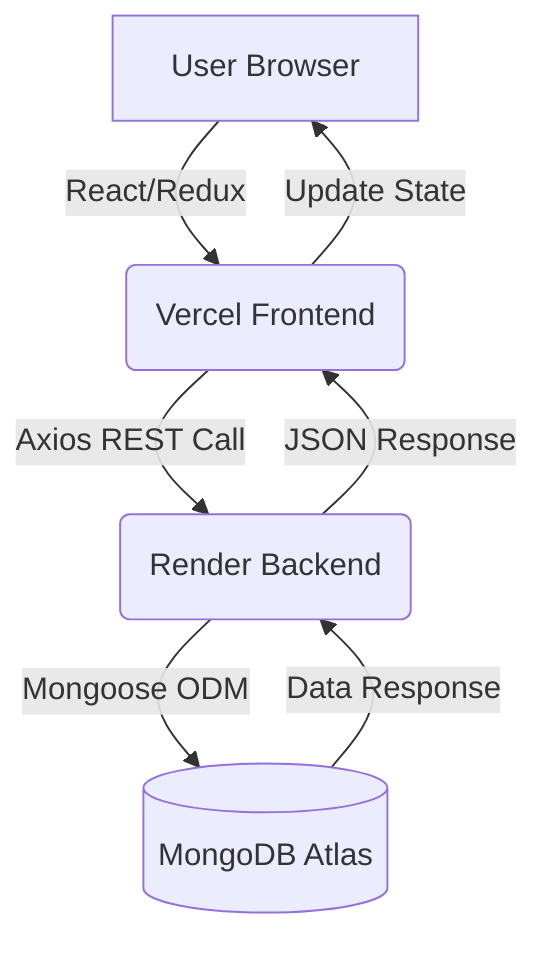
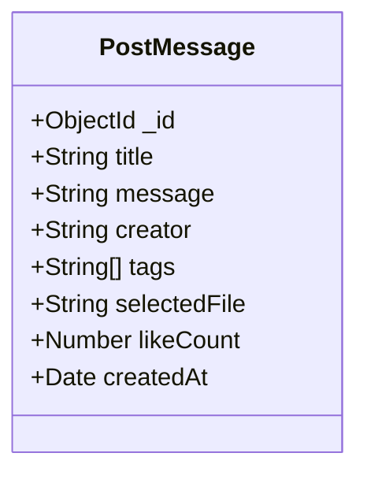
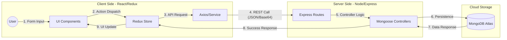

# 📸 Rewind - A Full Stack MERN Memory-Sharing Platform

Rewind is a feature-rich social media application built using the MERN stack that allows users to create, share, like, and manage personal memories. The project demonstrates a modern decoupled architecture with the frontend hosted on **Vercel** and the backend API on **Render**.

---

## 🚀 Live Links
- **Live Website:** [https://rewind-topaz.vercel.app](https://rewind-pied.vercel.app/)
- **API Endpoint:** [https://rewind-api-alwp.onrender.com](https://rewind-api-alwp.onrender.com)

---
## ✨Project at a Glance
<div align="center">

  | Deployment | Status | Latency | Security |
  | :--- | :--- | :--- | :--- |
  | **Frontend** |  | ~40ms | SSL Encrypted |
  | **Backend** |  | ~120ms | CORS Protected |
  | **Database** |  | 99.9% Uptime | AES-256 |

</div>

---

## 🏗 System Architecture & Workflow

The application follows a **Decoupled Monorepo Architecture**. The Client and Server communicate over HTTPS using RESTful principles.

### Workflow Diagram

---
## 📂 Folder ArchitecturePlaintextRewind/
```Plaintext

├── client/                # React Frontend
│   ├── src/
│   │   ├── api/          # Axios service configuration
│   │   ├── actions/      # Redux Action Creators
│   │   ├── reducers/     # Redux State Logic
│   │   ├── components/   # UI Components (Material-UI)
│   │   ├── styles/       # CSS-in-JS (MUI Styles)
│   │   └── index.js      # Frontend Entry Point
│   └── package.json
├── server/                # Node.js/Express Backend
│   ├── controllers/      # Request Handling Logic
│   ├── models/           # Mongoose Data Schemas
│   ├── routes/           # Express API Endpoints
│   ├── .env              # Environment Variables
│   └── index.js          # Backend Entry Point
└── README.md
```

---
## ✨ Features

- 📱 **Fully Responsive UI** - Seamless experience across Mobile, Tablet, and Desktop.
- 🎨 **Material Design** - Clean, modern aesthetics using Material-UI components.
- 🖼️ **Image Processing** - Real-time Base64 encoding for instant memory previews.
- 🔄 **Optimistic UI Updates** - Redux state updates instantly for 'Likes', ensuring zero lag for the user.
- ☁️ **Decoupled Architecture** - Frontend and Backend scale independently on separate cloud providers.
---

## 📊 Data Models (Entity Schema)

  Note for PostMessage "Base64 encoded string is used \n for the 'selectedFile' fie
  
  ---
## 📋 Database Schema Specification

The project utilizes MongoDB Atlas as the primary database. The data is structured using Mongoose ODM to ensure type safety and consistent document formatting.

| Field Name | Data Type | Requirement | Default | Description |
| :--- | :--- | :--- | :--- | :--- |
| **_id** | `ObjectId` | Auto-generated | - | Unique identifier for each memory post. |
| **title** | `String` | **Required** | - | Headline or subject of the memory. |
| **message** | `String` | **Required** | - | Detailed text content/story of the post. |
| **creator** | `String` | **Required** | - | Name or identifier of the user who authored the post. |
| **tags** | `[String]` | Optional | `[]` | Array of strings for categorization and search. |
| **selectedFile** | `String` | Optional | `""` | Image representation stored as a **Base64** encoded string. |
| **likeCount** | `Number` | Optional | `0` | Counter for total likes (incremented via `/likePost` endpoint). |
| **createdAt** | `Date` | **System** | `Date.now` | Timestamp of post creation for chronological sorting. |

---

### 🛠️ Implementation Snippet
Include this small snippet below the table to show you know how the code translates to the schema:

JavaScript
```bash
const postSchema = mongoose.Schema({
    title: String,
    message: String,
    creator: String,
    tags: [String],
    selectedFile: String,
    likeCount: {
        type: Number,
        default: 0,
    },
    createdAt: {
        type: Date,
        default: new Date(),
    },
})
```
---
## 🔄 Data Flow Diagram (DFD)
The following diagram illustrates the lifecycle of a memory post, from user input to persistent storage and retrieval.



---
### 📋 Process Description
**Level 0: The user interacts with the UI to input data (Title, Message, Tags, File).**

**Level 1: Redux handles the state management, dispatching actions to the asynchronous Axios service.**

**Level 2: The data is transmitted over HTTPS to the Render-hosted API as a JSON payload, including the Base64 image string.**

**Level 3: The Express server validates the payload and interacts with MongoDB via Mongoose ODM.**

**Level 4: Upon a successful database write, the state is updated globally, triggering a re-render of the Memory Feed without a page refresh.**

---
## 🚀 Performance & Optimization

- **Payload Compression:** Implemented custom body-parser limits (30mb) to handle high-resolution image uploads via JSON.
- **Lazy Loading:** React components are structured to ensure minimal initial bundle size.
- **State Normalization:** Used Redux to prevent unnecessary re-renders of the memory feed.
- **API Efficiency:** Single-trip data fetching where a single GET request retrieves all metadata and images, reducing TCP handshake overhead.
  
---

## 🛠 Tech Stack
**Frontend: React.js, Redux (State Management), Material-UI (UX/UI), Axios.**

**Backend: Node.js, Express.js.**

**Database: MongoDB Atlas.**

**Hosting: Vercel (Frontend), Render (Backend).**

**Tools: Git, Postman, Cloudinary/Base64 for images.**

---
## ⚙️ Installation & Setup
Follow these steps to get a local copy of the project up and running on your machine.

### 1. Prerequisites
Node.js (v16.x or higher)

npm (v8.x or higher)

MongoDB Atlas Account (for the database)

### 2. Clone the Repository
```bash
git clone https://github.com/yourusername/rewind-memories-app.git
cd rewind-memories-app
```
### 3. Backend Setup
Navigate to the server directory and install dependencies:
```bash
cd server
npm install
```
Create a .env file in the server folder and add your credentials:

```bash
PORT = 5000
CONNECTION_URL = mongodb+srv://<username>:<password>@cluster.mongodb.net/rewindDB
```
### 4. Frontend Setup
Open a new terminal, navigate to the client directory, and install dependencies:

```bash
cd client
npm install --legacy-peer-deps
```
Note: We use --legacy-peer-deps to handle older Material-UI dependencies from the tutorial.

### 5. Local Execution
Start the backend first:

```bash
# Inside /server
npm start
```
Then start the frontend:

```bash
# Inside /client
npm start
```
The application will now be running at http://localhost:3000 and communicating with the server at http://localhost:5000.

---

## 🌐 Cloud Deployment Strategy

This project implements a **Hybrid Multi-Cloud Strategy** to optimize performance and cost:

* **Frontend (Vercel Edge):** Deployed on Vercel to leverage Global Edge Networks, ensuring low latency for users worldwide.
* **Backend (Render Web Service):** Hosted on Render to provide a persistent, auto-scaling Node.js environment that maintains a stable connection pool to MongoDB Atlas.
* **Cross-Origin Resource Sharing (CORS):** Managed via middleware to allow secure communication between the `*.vercel.app` and `*.onrender.com` domain.

---

### ☁️ Deployment Configuration
## Backend (Render)
* **Create a New Web Service on Render.**

* **Root Directory: server.**

* **Build Command: npm install.**

* **Start Command: node index.js.**

* **Add CONNECTION_URL in the Environment Variables tab.**

## Frontend (Vercel)
* **Import the repository and set the Root Directory to client.**

* **Ensure the api/index.js file points to your live Render URL.**

* **Add CI=false as an Environment Variable.**

* **Deploy.**
---
## 🗺️ Roadmap

- [ ] **Google OAuth 2.0 Integration** - Secure user authentication.
- [ ] **Search & Pagination** - Enhanced discovery for large memory collections.
- [ ] **Dark Mode Toggle** - For better accessibility and user preference.
- [ ] **Cloudinary Integration** - Moving from Base64 to a dedicated CDN for image optimization.

 ---
 ## 🤝 Contributing

Contributions are what make the open-source community such an amazing place to learn, inspire, and create. Any contributions you make are **greatly appreciated**.

1. Fork the Project
2. Create your Feature Branch (`git checkout -b feature/AmazingFeature`)
3. Commit your Changes (`git commit -m 'Add some AmazingFeature'`)
4. Push to the Branch (`git origin push feature/AmazingFeature`)
5. Open a Pull Request

---
