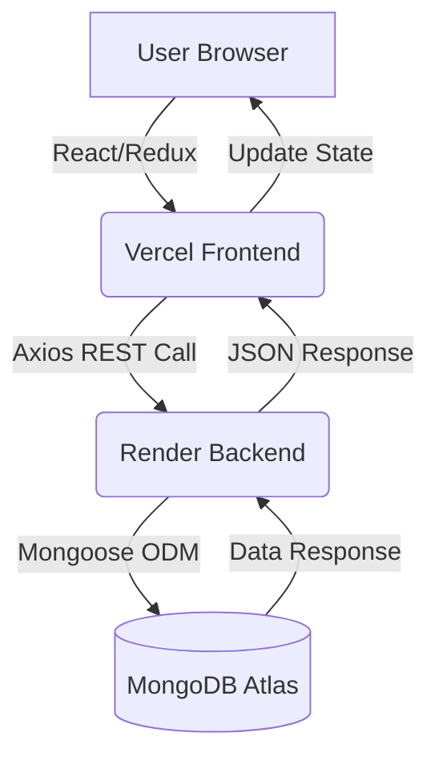
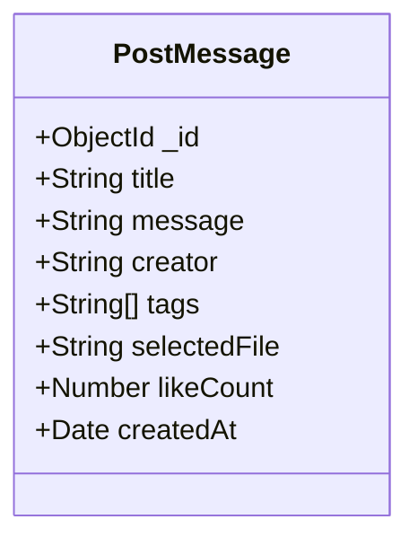

# 📸 Rewind - A Full Stack MERN Memory-Sharing Platform

Rewind is a feature-rich social media application built using the MERN stack that allows users to create, share, like, and manage personal memories. The project demonstrates a modern decoupled architecture with the frontend hosted on **Vercel** and the backend API on **Render**.

---

## 🚀 Live Links
- **Live Website:** [https://rewind-topaz.vercel.app](https://rewind-topaz.vercel.app)
- **API Endpoint:** [https://rewind-api-alwp.onrender.com](https://rewind-api-alwp.onrender.com)

---

## 🏗 System Architecture & Workflow

The application follows a **Decoupled Monorepo Architecture**. The Client and Server communicate over HTTPS using RESTful principles.

### Workflow Diagram

---
📂 Folder ArchitecturePlaintextRewind/
```Plaintext

├── client/                # React Frontend
│   ├── src/
│   │   ├── api/          # Axios service configuration
│   │   ├── actions/      # Redux Action Creators
│   │   ├── reducers/     # Redux State Logic
│   │   ├── components/   # UI Components (Material-UI)
│   │   ├── styles/       # CSS-in-JS (MUI Styles)
│   │   └── index.js      # Frontend Entry Point
│   └── package.json
├── server/                # Node.js/Express Backend
│   ├── controllers/      # Request Handling Logic
│   ├── models/           # Mongoose Data Schemas
│   ├── routes/           # Express API Endpoints
│   ├── .env              # Environment Variables
│   └── index.js          # Backend Entry Point
└── README.md
```

---
## 📊 Data Models (Entity Schema)

  Note for PostMessage "Base64 encoded string is used \n for the 'selectedFile' fie
  ---

 
