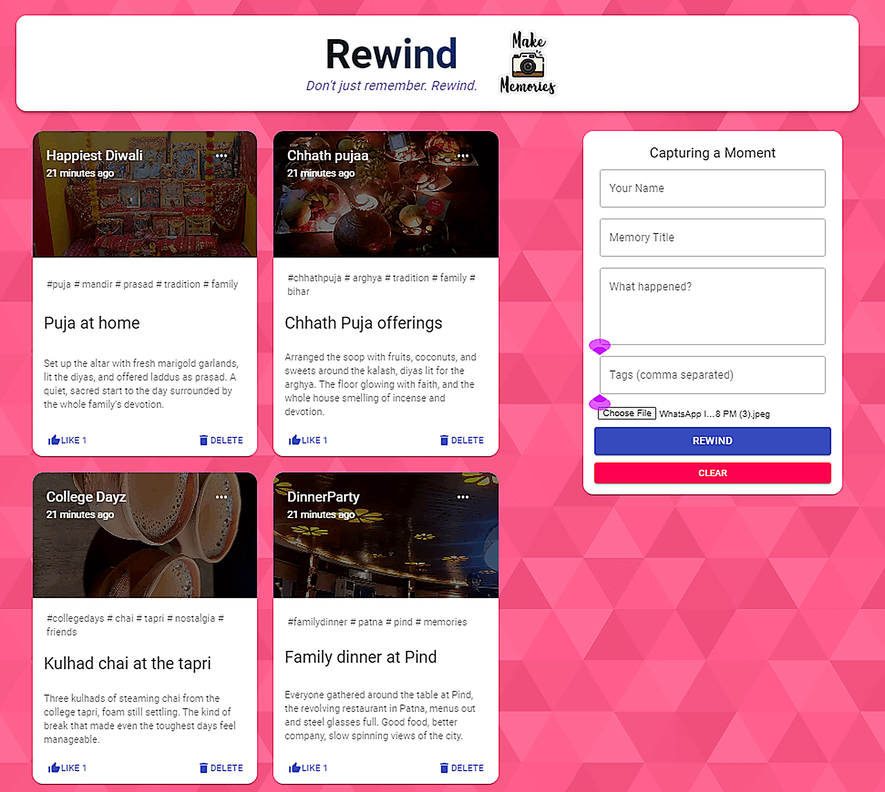
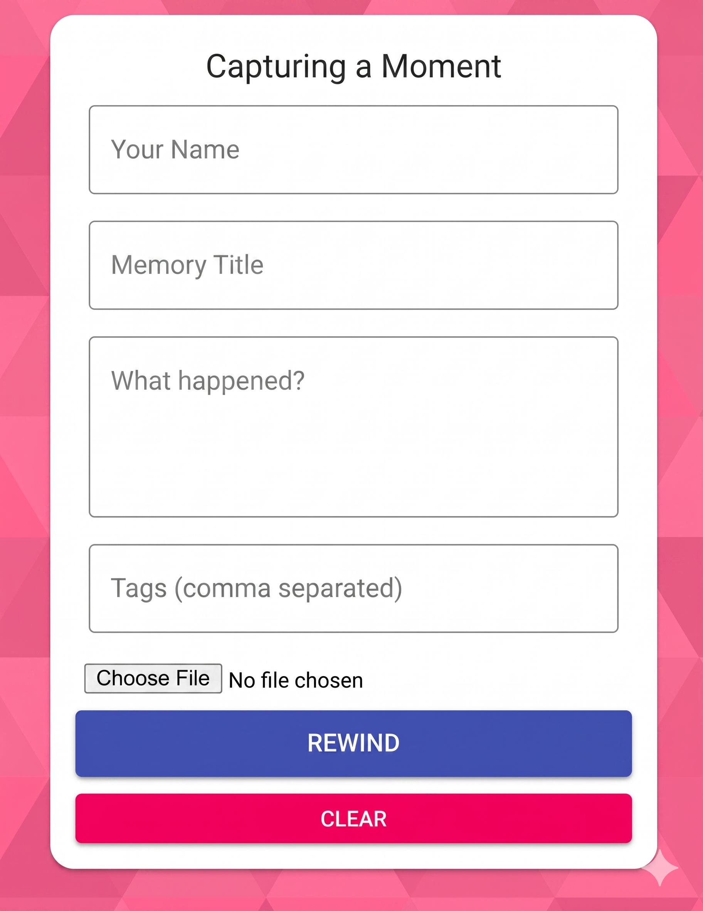
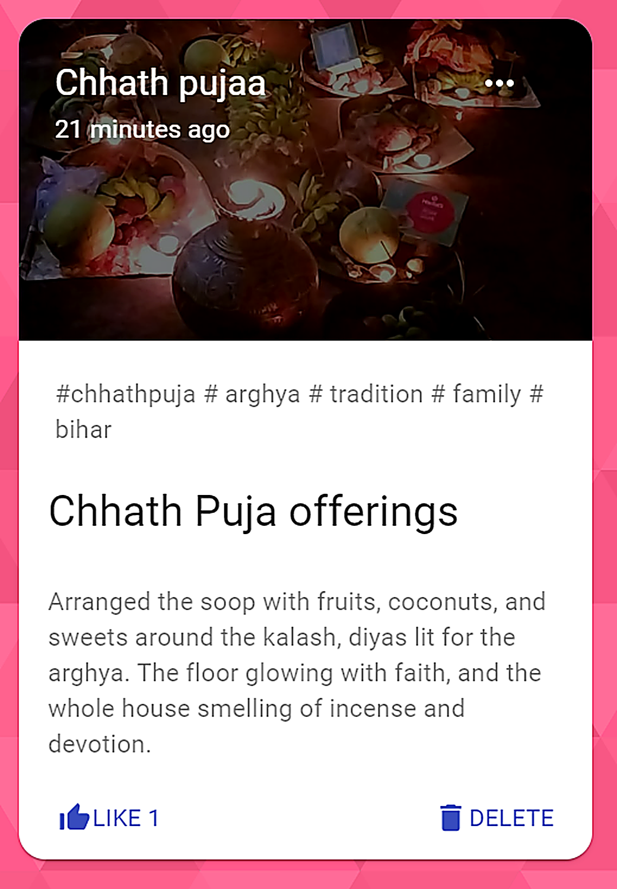
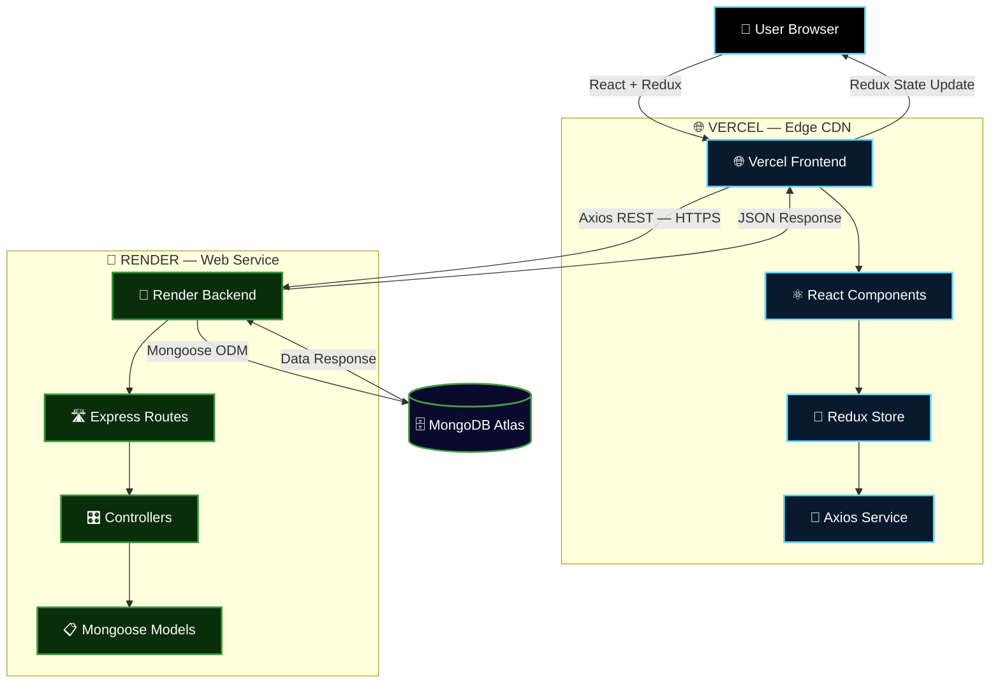
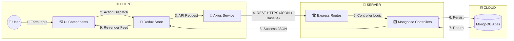
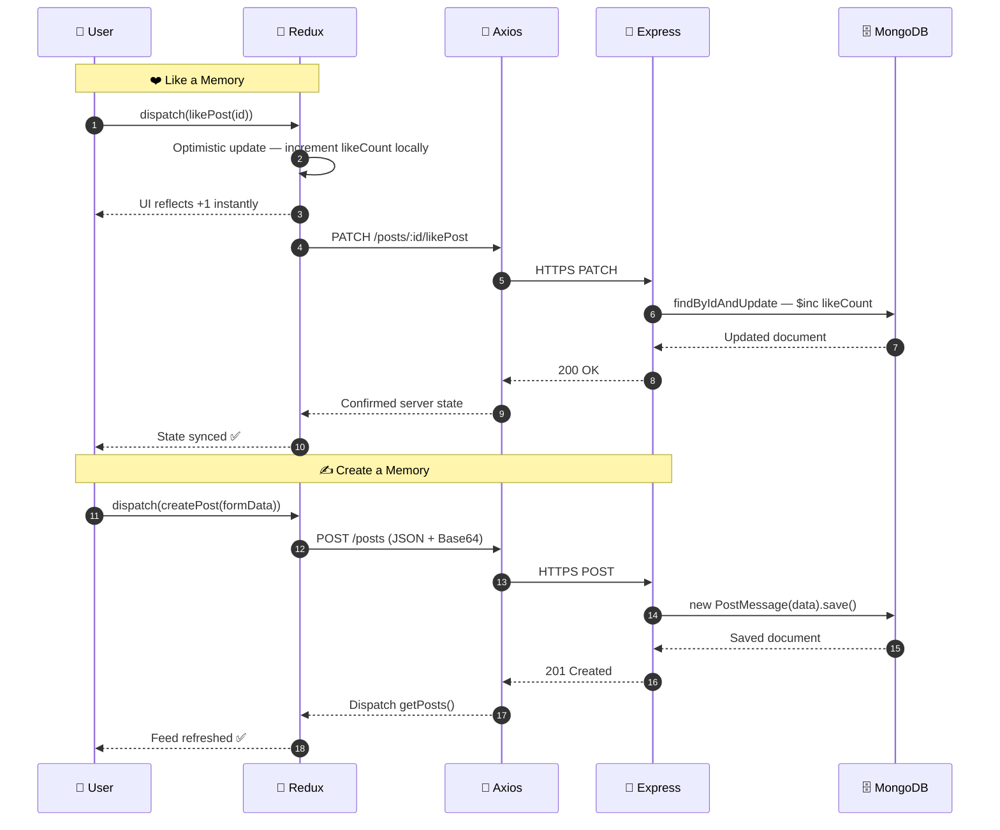

<div align="center">


<br/>

<a href="https://rewind-pied.vercel.app">
  
</a>

<br/><br/>


<br/>


<br/><br/>

> *"A feature-rich social memory platform built on the MERN stack — where every scroll is a trip down memory lane."*

<br/>

<a href="https://rewind-pied.vercel.app"></a>
&nbsp;
<a href="#-quick-start"></a>
&nbsp;
<a href="%EF%B8%8F-system-architecture"></a>
&nbsp;
<a href="https://github.com/salonyranjan/rewind-memories-app/stargazers"></a>

</div>

<br/>

## 📋 Table of Contents

1. [What is Rewind?](#-what-is-rewind)
2. [UI Showcase](#%EF%B8%8F-ui-showcase)
3. [Key Features](#-key-features)
4. [System Architecture](#%EF%B8%8F-system-architecture)
5. [Data Model](#%EF%B8%8F-data-model)
6. [Tech Stack](#%EF%B8%8F-tech-stack)
7. [Project Structure](#-project-structure)
8. [Quick Start](#-quick-start)
9. [Cloud Deployment](#%EF%B8%8F-cloud-deployment)
10. [Performance](#-performance--optimisation)
11. [Roadmap](#%EF%B8%8F-roadmap)
12. [FAQ](#-faq)
13. [Contributing](#-contributing)
14. [Author](#-author)

---

## 📸 What is Rewind?

**Rewind** is a full-stack social memory platform built on the **MERN stack**. Users create richly-tagged memory cards — images, stories, likes — and share them with the world. It's a demonstration of **decoupled architecture**: a React + Redux frontend on Vercel's global edge, and an Express + MongoDB backend scaling independently on Render.

> 🎯 **Built to showcase:** full-stack MERN mastery, Redux state management, RESTful API design, multi-cloud deployment, and optimistic UI patterns.

<div align="center">

| 🔖 Release | 📦 Highlight |
|:---:|:---|
| `v2.0` | Decoupled multi-cloud deploy · Optimistic Redux likes · Base64 image processing |

</div>

🔗 **Live Website:** [rewind-pied.vercel.app](https://rewind-pied.vercel.app) &nbsp;·&nbsp; 🔌 **API:** [rewind-api-alwp.onrender.com](https://rewind-api-alwp.onrender.com)

---

## 🖼️ UI Showcase

<div align="center">

### Memory Feed — the main stage


<sub>Responsive Material-UI grid — 4-column desktop down to single-column mobile · likes update instantly via optimistic Redux state.</sub>

<br/><br/>

<table>
<tr>
<td width="50%" align="center">

<br/><b>Create / Edit Memory</b><br/>
<sub>Real-time Base64 image preview · tag-chip input · inline validation.</sub>
</td>
<td width="50%" align="center">

<br/><b>Memory Card</b><br/>
<sub>Optimistic like, relative timestamps, edit/delete for the creator.</sub>
</td>
</tr>
</table>

</div>

| Feature | 📱 Mobile | 💻 Tablet | 🖥️ Desktop |
|:---|:---:|:---:|:---:|
| Memory Feed Grid | ✅ 1-col | ✅ 2-col | ✅ 4-col |
| Create / Edit Form | ✅ | ✅ | ✅ |
| Optimistic Like | ✅ | ✅ | ✅ |
| Tag Filter | ✅ | ✅ | ✅ |
| Dark Mode *(roadmap)* | 🔄 | 🔄 | 🔄 |

---

## ✨ Key Features

| | Feature | Description |
|:---:|:---|:---|
| 📱 | **Fully Responsive UI** | Material-UI grid adapts flawlessly from mobile to ultra-wide desktop |
| 🔄 | **Optimistic UI Updates** | Redux state updates instantly on Like — before the server confirms — killing perceived lag |
| 🖼️ | **Real-Time Image Preview** | Base64 encoding renders previews inline the moment a file is selected — no upload round-trip |
| 🏷️ | **Tag-Based Discovery** | Multi-tag support on every memory, filterable in real time |
| ☁️ | **Decoupled Multi-Cloud** | Frontend on Vercel's edge, backend on Render — each scales and deploys independently |
| 🔐 | **CORS Protection** | Server-side middleware restricts access to verified frontend origins only |
| 🗄️ | **Mongoose ODM** | Type-safe, schema-validated document storage with auto-timestamps |
| 📦 | **30 MB Payload Support** | Custom body-parser limits handle high-res Base64 uploads without failure |

---

## 🏗️ System Architecture

A **decoupled monorepo** — client and server live in one repo but deploy to separate providers and scale independently.


```mermaid
graph TD
    U[👤 User Browser] -->|React + Redux| VF[🌐 Vercel Frontend]
    VF -->|Axios REST — HTTPS| RB[🔌 Render Backend]
    RB -->|Mongoose ODM| DB[(🗄️ MongoDB Atlas)]
    DB -->|Data Response| RB
    RB -->|JSON Response| VF
    VF -->|Redux State Update| U

    subgraph Frontend ["🌐 VERCEL — Edge CDN"]
        VF --> RC[⚛️ React Components] --> RX[🔄 Redux Store] --> AX[📡 Axios Service]
    end

    subgraph Backend ["🔌 RENDER — Web Service"]
        RB --> RT[🛣️ Express Routes] --> CT[🎛️ Controllers] --> MD[📋 Mongoose Models]
    end

    classDef fe fill:#0a1a2e,stroke:#61DAFB,stroke-width:2px,color:#fff;
    classDef be fill:#0a2e0a,stroke:#339933,stroke-width:2px,color:#fff;
    classDef db fill:#0a0a2e,stroke:#47A048,stroke-width:2px,color:#fff;
    classDef user fill:#000,stroke:#61DAFB,stroke-width:2px,color:#fff;

    class U user;
    class VF,RC,RX,AX fe;
    class RB,RT,CT,MD be;
    class DB db;
```

<details>
<summary><b>🔄 Data flow diagram</b></summary>


```mermaid
graph LR
    subgraph Client_Side ["⚛️ CLIENT"]
        U((👤 User)) -- "1. Form Input" --> UI[🖼️ UI Components]
        UI -- "2. Action Dispatch" --> RD[🔄 Redux Store]
        RD -- "3. API Request" --> AX[📡 Axios Service]
    end

    subgraph Server_Side ["🔌 SERVER"]
        AX -- "4. REST HTTPS (JSON + Base64)" --> RT[🛣️ Express Routes]
        RT -- "5. Controller Logic" --> CT[🎛️ Mongoose Controllers]
    end

    subgraph Storage ["🗄️ CLOUD"]
        CT -- "6. Persist" --> DB[(MongoDB Atlas)]
        DB -- "7. Return" --> CT
    end

    CT -- "8. Success JSON" --> RD
    RD -- "9. Re-render Feed" --> UI
```

| Level | Actor | Action |
|:---:|:---|:---|
| 0 | 👤 User | Inputs Title, Message, Tags, Image via form |
| 1 | ⚛️ Redux | Dispatches async action to the Axios service layer |
| 2 | 📡 Axios | Transmits JSON + Base64 payload over HTTPS to Render |
| 3 | 🎛️ Express | Validates payload, writes to MongoDB via Mongoose |
| 4 | 🔄 Redux | Receives the success response, updates global state, re-renders |

</details>

<details>
<summary><b>⚡ Request lifecycle sequence</b></summary>


```mermaid
sequenceDiagram
    autonumber
    participant U as 👤 User
    participant RX as 🔄 Redux
    participant AX as 📡 Axios
    participant EX as 🔌 Express
    participant DB as 🗄️ MongoDB

    Note over U,RX: ❤️ Like a Memory
    U->>RX: dispatch(likePost(id))
    RX->>RX: Optimistic update — increment likeCount locally
    RX-->>U: UI reflects +1 instantly

    RX->>AX: PATCH /posts/:id/likePost
    AX->>EX: HTTPS PATCH
    EX->>DB: findByIdAndUpdate — $inc likeCount
    DB-->>EX: Updated document
    EX-->>AX: 200 OK
    AX-->>RX: Confirmed server state
    RX-->>U: State synced ✅

    Note over U,EX: ✍️ Create a Memory
    U->>RX: dispatch(createPost(formData))
    RX->>AX: POST /posts (JSON + Base64)
    AX->>EX: HTTPS POST
    EX->>DB: new PostMessage(data).save()
    DB-->>EX: Saved document
    EX-->>AX: 201 Created
    AX-->>RX: Dispatch getPosts()
    RX-->>U: Feed refreshed ✅
```

</details>

---

## 🗄️ Data Model

| Field | Type | Required | Default | Description |
|:---|:---:|:---:|:---:|:---|
| `_id` | `ObjectId` | Auto | — | Unique document identifier |
| `title` | `String` | ✅ | — | Headline of the memory |
| `message` | `String` | ✅ | — | Detailed story or description |
| `creator` | `String` | ✅ | — | Name or ID of the author |
| `tags` | `[String]` | ❌ | `[]` | Categorisation & tag search |
| `selectedFile` | `String` | ❌ | `""` | Image stored as a Base64 string |
| `likeCount` | `Number` | ❌ | `0` | Incremented via `PATCH /likePost` |
| `createdAt` | `Date` | System | `Date.now` | Auto-timestamp for feed sorting |

> 💡 `selectedFile` stores images as Base64 directly in MongoDB — fine at demo scale, but migrate to a CDN (Cloudinary, S3) for production. See [Roadmap](#%EF%B8%8F-roadmap).

<details>
<summary><b>🛠️ Schema implementation</b></summary>

```javascript
// server/models/postMessage.js
import mongoose from 'mongoose';

const postSchema = mongoose.Schema({
    title:        String,
    message:      String,
    creator:      String,
    tags:         [String],
    selectedFile: String,
    likeCount:    { type: Number, default: 0 },
    createdAt:    { type: Date, default: new Date() },
});

const PostMessage = mongoose.model('PostMessage', postSchema);
export default PostMessage;
```

</details>

---

## 🛠️ Tech Stack

<table>
<tr><td valign="top" width="33%">

**⚛️ Frontend**
- React 18
- Redux + async thunks
- Material-UI
- Axios

</td><td valign="top" width="33%">

**🔌 Backend**
- Node.js + Express
- Mongoose ODM
- CORS middleware
- `bodyParser` 30 MB payloads

</td><td valign="top" width="33%">

**🗄️ Data & Cloud**
- MongoDB Atlas
- Vercel (frontend edge)
- Render (backend service)

</td></tr>
</table>

---

## 📂 Project Structure

```
Rewind/
├── client/                       # React frontend
│   └── src/
│       ├── api/index.js           # Axios service — base URL + calls
│       ├── actions/posts.js       # Redux async action creators
│       ├── reducers/posts.js      # Redux state reducer
│       ├── components/
│       │   ├── Home/               # Memory feed + layout
│       │   ├── Posts/Post/         # Individual memory card
│       │   └── Form/               # Create & edit memory form
│       └── App.js
├── server/                       # Node.js / Express backend
│   ├── controllers/posts.js       # CRUD logic
│   ├── models/postMessage.js      # Mongoose schema
│   ├── routes/posts.js            # Route → controller bindings
│   └── index.js                   # Express entry — middleware, CORS, DB
├── screenshots/                  # README media
└── README.md
```

---

## 📦 Quick Start

**Prerequisites:** Node.js ≥ 16, npm ≥ 8, Git, a free [MongoDB Atlas](https://www.mongodb.com/atlas) cluster

```bash
# 1. Clone
git clone https://github.com/salonyranjan/rewind-memories-app.git
cd rewind-memories-app

# 2. Backend
cd server
npm install

# 3. Frontend
cd ../client
npm install --legacy-peer-deps   # resolves MUI v4 peer conflicts
```

**Configure secrets** — create `server/.env`:

```env
PORT=5000
CONNECTION_URL=mongodb+srv://<username>:<password>@cluster.mongodb.net/rewindDB
```

Point the frontend to your local API in `client/src/api/index.js`:

```javascript
const API = axios.create({ baseURL: 'http://localhost:5000' });
```

> Revert this to your Render URL before deploying.

**Run it:**

```bash
# Terminal 1 — backend
cd server && npm start        # → localhost:5000

# Terminal 2 — frontend
cd client && npm start        # → localhost:3000
```

---

## ☁️ Cloud Deployment

A **hybrid multi-cloud strategy** — Vercel's edge network for the frontend, Render's persistent Node.js environment for the backend.

**Backend → Render**
```
Root Directory: server
Build Command:  npm install
Start Command:  node index.js
Env Vars:       CONNECTION_URL = your MongoDB Atlas URI
```
```javascript
// server/index.js — whitelist your deployed frontend
app.use(cors({ origin: 'https://your-app.vercel.app' }));
```

**Frontend → Vercel**
```
Root Directory: client
Env Vars:       CI = false
Confirm client/src/api/index.js points to your live Render URL
Deploy — auto-redeploys on every push to main
```

---

## ⚡ Performance & Optimisation

| Metric | Value | Implementation |
|:---|:---:|:---|
| Frontend Latency | `~40ms` | Vercel global edge CDN |
| API Response | `~120ms` | Render persistent Node.js |
| DB Uptime | `99.9%` | MongoDB Atlas free-tier SLA |
| Payload Limit | `30 MB` | Custom `bodyParser` config |
| Like UX | `0ms perceived` | Optimistic Redux state update |
| API Calls | Single-trip GET | All metadata + images in one request |

---

## 🗺️ Roadmap

- [x] CRUD — create, read, update, delete memories
- [x] Optimistic Redux like system
- [x] Base64 image handling with preview
- [x] Decoupled Vercel + Render deployment
- [ ] **Google OAuth 2.0** — secure user authentication
- [ ] **Search & pagination** — discover large memory collections
- [ ] **Cloudinary CDN** — replace Base64 with dedicated image hosting
- [ ] **Dark mode toggle**
- [ ] **Comment system** — threaded replies per memory
- [ ] **Memory detail page** — full-screen single view
- [ ] 💡 Stories mode — auto-play slideshow of memories
- [ ] 💡 Private collections — visibility controls per post

> 💬 [Open a feature request →](https://github.com/salonyranjan/rewind-memories-app/issues/new)

---

## ❓ FAQ

<details>
<summary><b>Why does the API take a few seconds to respond on first load?</b></summary><br/>

The backend runs on Render's free tier, which spins down after 15 minutes of inactivity. The first request "cold-starts" the service (30–60s); subsequent requests are fast. A paid Render plan removes cold starts in production.
</details>

<details>
<summary><b>Why are images stored as Base64 instead of a CDN?</b></summary><br/>

It keeps the architecture simple for a portfolio project — no third-party image service setup. The trade-off is document size and query performance at scale; Cloudinary migration is on the [Roadmap](#%EF%B8%8F-roadmap).
</details>

<details>
<summary><b>Why does the frontend install need --legacy-peer-deps?</b></summary><br/>

Material-UI v4 has peer-dependency conflicts with newer React versions. The flag tells npm to use the older resolution algorithm and ignore them — everything still works correctly at runtime.
</details>

<details>
<summary><b>How does CORS work between Vercel and Render?</b></summary><br/>

The Express server uses the `cors` package as middleware, whitelisting only the Vercel frontend origin. Any other cross-origin request is blocked, so the API can't be hit directly by unauthorised clients.
</details>

---

## 🤝 Contributing

```bash
git checkout -b feature/your-feature
git commit -m "feat: add your feature"   # fix: | docs: | style: | refactor: | test: | chore:
git push origin feature/your-feature
```

**Priority areas:** Google OAuth 2.0 (Passport.js/Firebase) · Cloudinary image migration · server-side search & pagination · Jest + RTL test coverage · dark mode via MUI `ThemeProvider`.

---

## 👤 Author

<table style="border:none;">
  <tr>
    <td align="center" style="border:none;" width="150">
      
    </td>
    <td style="border:none; padding-left:22px;">
      <h3>✦ Salony Ranjan</h3>
      <br/>
      <a href="https://www.linkedin.com/in/salony-ranjan-b63200280/"></a>
      &nbsp;
      <a href="https://github.com/salonyranjan"></a>
      &nbsp;
      <a href="mailto:salonyranjan@gmail.com"></a>
      &nbsp;
      <a href="https://vertex-flow-phi.vercel.app/"></a>
    </td>
  </tr>
</table>

---

<div align="center">

### ⭐ If Rewind helped you learn MERN or inspired your own project — star it

<br/><br/>

<a href="https://github.com/salonyranjan/rewind-memories-app/stargazers"></a>
&nbsp;
<a href="https://github.com/salonyranjan/rewind-memories-app/fork"></a>
&nbsp;
<a href="https://rewind-pied.vercel.app"></a>
&nbsp;
<a href="https://github.com/salonyranjan/rewind-memories-app/issues/new"></a>

<br/><br/>


*Made with* 📸 *by* [**Salony Ranjan**](https://github.com/salonyranjan) &nbsp;·&nbsp; *© 2026 Rewind · MIT License*


</div>
